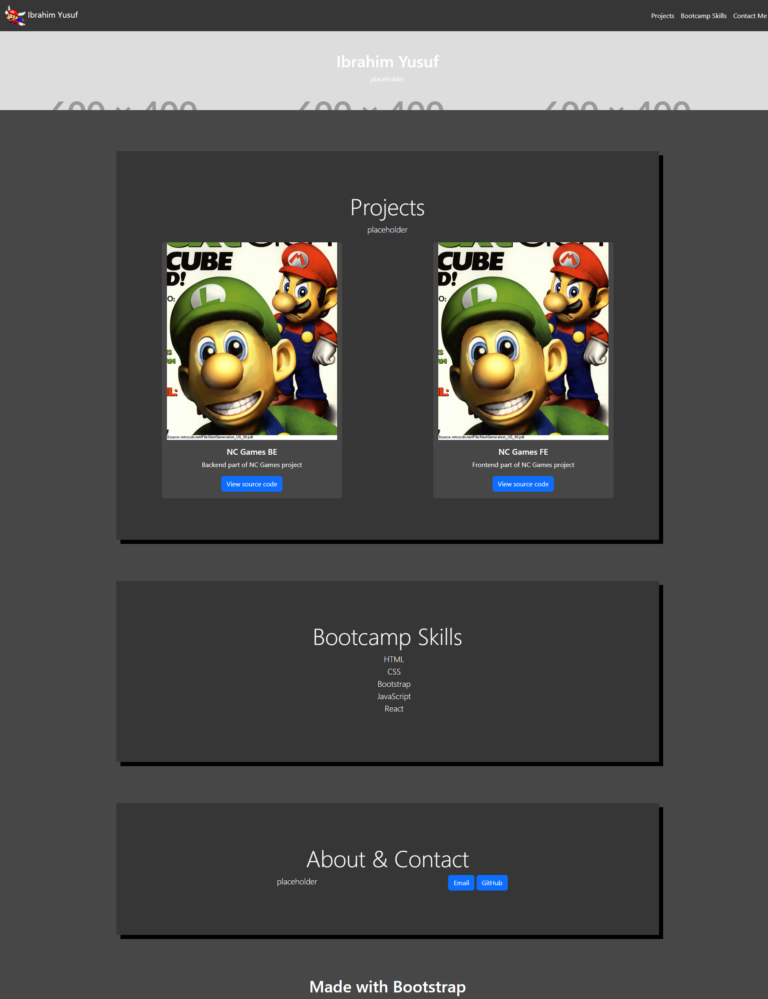

# Bootstrap Portfolio

Solution to the edX front-end bootcamp Module 3 challenge. It's a simple portfolio that uses [Bootstrap](https://getbootstrap.com).

## Usage
Open `index.html` in a web browser or with the Live Server extension for VS Code. [This site is also hosted on GitHub Pages.](https://iy2k22.github.io/bootstrap-portfolio)

## Credits
* Mario belongs to Nintendo.
* Placeholder image is obtained from [placehold.co](https://placehold.co).
* I believe the cursed image of Luigi is from a Nintendo magazine.